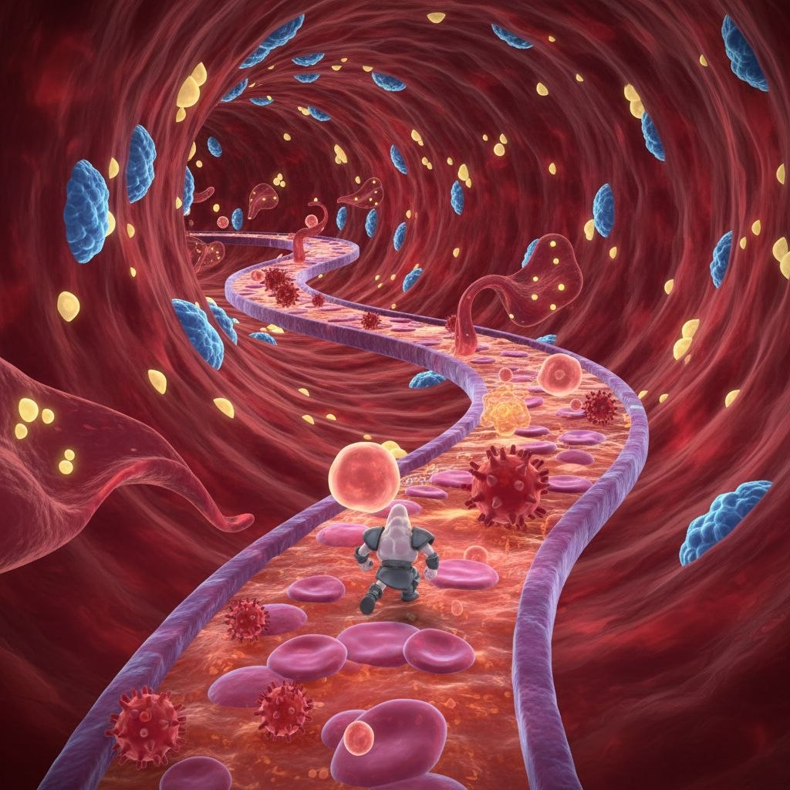

# Phagos Space — analisis referensi visual dan rencana teknis

> Status: **fase pra-produksi**. Dokumen ini dibuat setelah `Gameplay-Arena.jpg` dilihat langsung. Belum ada scene gameplay atau script game yang dibuat; toolchain sudah dipersiapkan supaya implementasi berikutnya dapat dimulai dari referensi yang sama.
>
> Arsitektur login Web2, Ronin Web3, IAP, referral, dan airdrop dicatat terpisah di [`WEB3_AUTH_PAYMENTS_PLAN.md`](WEB3_AUTH_PAYMENTS_PLAN.md). Urutan delivery dan progress gate ada di [`PROJECT_ROADMAP.md`](PROJECT_ROADMAP.md).

## 1. Referensi yang menjadi sumber kebenaran



- File kanonik: `Gameplay-Arena.jpg`
- Resolusi: **1024 × 1024 px**, rasio 1:1.
- Referensi ini adalah satu frame komposisi gameplay, bukan concept art yang bebas ditafsirkan. Karena itu kamera, jalur, proporsi, palette, dan penempatan elemen akan dikalibrasi terhadap frame ini.
- Tidak ada HUD, teks, menu, crosshair, atau elemen UI pada frame. Implementasi awal tidak akan menambahkan HUD yang mengubah siluet visual frame.
- `Gameplay-Arena.jpg` tetap dipakai sebagai overlay pembanding selama blockout dan screenshot regression.

## 2. Pembacaan visual detail

### 2.1 Struktur ruang dan komposisi

| Zona frame | Isi yang terlihat | Konsekuensi untuk level |
|---|---|---|
| 0–18% tinggi | Atap/selaput pembuluh merah gelap, alur serat melingkar, beberapa sel biru dan partikel kuning terpotong frame | Dinding adalah ruang 3D melengkung, bukan skybox datar. Objek yang terpotong harus tetap punya volume dan gerak saat kamera maju. |
| 18–42% tinggi | Koridor mengecil menuju area tengah; jalur ungu-oranye berkelok; vesikel merah muda dengan bintik kuning menggantung di kanan dan bentuk kecil di kiri | Ini adalah titik fokus/vanishing area. Jalur tidak boleh menjadi garis lurus. |
| 42–70% tinggi | Tikungan jalur yang jelas, sel darah dan virus berduri di atas jalur, sel biru menempel di dinding | Detail gameplay paling padat. Kamera harus masih dapat membaca hazard dan permukaan jalur. |
| 70–100% tinggi | Jalur membesar ke foreground; avatar kecil berada sekitar tengah-x, y sekitar 70%; sel darah merah, virus, dan sel biru memenuhi sisi | Avatar dibaca dari belakang dalam third-person chase view. Foreground memberi rasa skala dan kedalaman. |

### 2.2 Elemen yang wajib dipertahankan

1. **Dinding pembuluh darah**: latar marun-merah, tubular/cekung, dengan serat organik radial dan aliran menuju kedalaman. Bukan ruang kosong dan bukan gua batu.
2. **Jalur utama**: ribbon/jembatan organik warna salmon-oranye, memiliki dua bibir/rail tebal ungu-lavender. Jalurnya berkelok seperti S dan semakin mengecil menuju kedalaman.
3. **Sel biru bertekstur**: bentuk oval tidak beraturan, menempel/melayang dekat dinding; merupakan aksen biru terbesar pada frame.
4. **Partikel kuning**: bentuk kecil pipih/oval, tersebar di seluruh volume dan lebih terang daripada dinding.
5. **Sel darah merah**: bentuk bulat/oval merah muda-transparan, berada di jalur dan foreground dengan ukuran bervariasi.
6. **Patogen berduri**: bola merah marun dengan spike pendek; beberapa ada di jalur depan dan kiri bawah. Ini menjadi hazard/enemy paling mudah dibaca.
7. **Vesikel/amoeba merah muda**: bentuk transparan bergelombang dengan bintik kuning di bagian kanan tengah, kiri tengah, dan kedalaman. Bentuknya harus terasa menggantung/berenang, bukan sekadar sphere.
8. **Avatar**: karakter kecil humanoid dari belakang, helm putih/abu, badan dan backpack gelap, anggota badan abu-abu. Posisi awal di foreground tengah, menghadap jalur.
9. **Cahaya**: ambience merah muda hangat dari lumen pembuluh, aksen biru dingin, dan aksen kuning bercahaya. Kontras avatar harus tetap terbaca terhadap jalur.

### 2.3 Gaya visual

- **Makro-biologis sinematik**: permukaan terasa basah, translucent, dan organik; bukan low-poly datar walaupun beberapa asset 3D dapat dipakai sebagai dasar.
- Siluet organik lebih penting daripada jumlah polygon. Detail mikro dibuat dengan normal/roughness/emission/shader dan instancing, bukan ribuan node unik.
- Tidak memakai outline kartun atau warna UI neon yang tidak ada di referensi.
- Transparansi dipakai selektif pada sel/vesikel; sorting Web harus diuji agar sel tidak flicker.

### 2.4 Perkiraan warna awal

Ini adalah palette visual awal untuk blockout, bukan klaim sampling warna pixel-per-pixel. Nilai akhir harus dikunci melalui screenshot overlay.

| Peran | Warna awal |
|---|---|
| Dinding inti | `#5A151F` / `#7B202B` |
| Serat/highlight dinding | `#A84752` |
| Permukaan jalur | `#C97979` / `#D89187` |
| Rail jalur | `#80639E` / `#A083B9` |
| Sel biru | `#2E78A6` / `#6FA4C5` |
| Partikel kuning | `#E5B948` / `#FFE08A` |
| Sel darah merah | `#D9645F` / `#F28E82` |
| Patogen | `#8E2634` / `#B33B45` |
| Avatar | abu-abu `#71777F`, highlight `#C7CBD0`, aksen gelap `#272D34` |

## 3. Pembacaan kamera yang tepat

### 3.1 Kesimpulan

Kamera yang paling tepat adalah **perspective third-person chase camera yang terkunci pada tangent jalur**, bukan top-down, bukan first-person, dan bukan kamera bebas orbit. Avatar terlihat dari belakang dan sedikit dari atas; ia berada di lower-center untuk memberi ruang pandang besar ke koridor di depan.

Satu foto 2D tidak bisa memberi koordinat 3D absolut yang unik. Yang bisa ditentukan dengan kuat adalah jenis kamera, relasi kamera-avatar, framing, dan titik hilang. Koordinat di bawah adalah starting calibration yang harus divalidasi dengan overlay, bukan angka final yang boleh menggantikan foto.

### 3.2 Landmarks yang harus dicocokkan

| Landmark | Posisi perkiraan di foto | Target implementasi |
|---|---:|---|
| Pusat avatar | x ≈ 512 px, y ≈ 715 px | x screen 0.50, y screen 0.70; jangan center-kan avatar di 0.50 tinggi |
| Titik hilang koridor | x ≈ 455–500 px, y ≈ 300–350 px | sedikit di atas pusat layar; tangent kamera mengarah ke sana |
| Rail foreground kiri/kanan | x ≈ 95 px dan 845 px di bawah frame | lebar jalur memenuhi sekitar 73% frame pada foreground |
| Area tikungan utama | x ≈ 250–815 px, y ≈ 300–620 px | kurva S harus terbaca dalam satu shot, tanpa cut |
| Dinding | 100% frame di belakang jalur | tidak boleh terlihat langit/void hitam di luar lumen |

### 3.3 Konfigurasi kamera awal Godot

Nilai ini menjadi preset awal `CameraRig`, lalu disetel menggunakan overlay screenshot:

```text
Projection       Perspective
Reference aspect 1.0 (1024 x 1024)
Vertical FOV     50° (uji rentang 48°–56°)
Near             0.05 m
Far              180 m
Position local   (0.0, 3.8, 6.2) relatif terhadap avatar/path tangent
Look target      (0.0, 1.15, -8.0) relatif terhadap avatar/path tangent
Pitch awal       sekitar -12° ke bawah
Roll             0°
Smoothing        4–6, tanpa lag yang memindahkan avatar dari lower-center
```

Godot menganggap arah depan kamera menuju `-Z`; nilai `z = 6.2` berarti kamera berada di belakang avatar apabila avatar menghadap ke depan jalur. Kamera dipasang pada `PathFollow3D`/rig yang mengikuti tangent `Curve3D`, sementara avatar memiliki lane offset kecil di kiri/kanan. Camera rig tidak menerima input orbit agar komposisi tetap 100% mengikuti referensi.

### 3.4 Prosedur kalibrasi, bukan tebakan manual

1. Buat jalur blockout dengan lebar relatif benar dan lima sampai tujuh control point yang membentuk S.
2. Set viewport dan screenshot ke 1024 × 1024.
3. Tampilkan `Gameplay-Arena.jpg` sebagai overlay 50% di tool pembanding, bukan sebagai texture di game final.
4. Kunci lebih dahulu posisi avatar dan dua rail foreground.
5. Geser FOV untuk menyamakan penyempitan perspektif; jangan memperbaiki mismatch FOV dengan menscale objek.
6. Geser pitch/target sampai titik hilang jalur jatuh di area tengah-atas referensi.
7. Baru cocokkan control point jalur, dinding, dan prop placement.
8. Simpan preset kamera dan screenshot baseline. Setiap perubahan asset harus lulus overlay baseline.

## 4. Semua elemen dibuat hidup dan beranimasi

Tidak boleh ada objek dekoratif penting yang benar-benar statis. Animasi bukan berarti semua objek bergerak cepat; gerak mikro yang periodik sudah cukup selama selalu terlihat hidup.

| Elemen | Gerak wajib | Implementasi efisien |
|---|---|---|
| Dinding/serat pembuluh | gelombang kontraksi dan aliran halus ke vanishing point | shader vertex noise + UV flow, satu mesh lumen bersegmen |
| Jalur salmon | denyut/pulse yang bergerak mengikuti tangent dan sedikit deformasi | mesh ribbon dari `Curve3D`, shader scroll + pulse parameter |
| Rail ungu | elastis, naik-turun tipis saat pulse lewat | ribbon side mesh + offset sinus kecil |
| Sel biru | slow drift/adhere, rotasi kecil, scale pulse berbeda fase | GPU MultiMesh/instancing + per-instance seed |
| Partikel kuning | drift 3D, twinkle, variasi depth dan ukuran | `GPUParticles3D`, emission ringan, additive lembut |
| Sel darah merah | bobbing, spin, deformasi biconcave/scale, terseret arus | instanced mesh + shader wobble; collision hanya untuk yang gameplay |
| Patogen berduri | bob, spike pulse, rotasi lambat, reaksi saat dekat avatar | scene enemy + `AnimationPlayer`/shader; AI lane sederhana |
| Vesikel/amoeba | membran mengembang-mengempis, bintik internal ikut bergerak, tentacle sway | mesh/procedural blob + shader noise + bone/tentacle animation |
| Avatar | idle breathing, langkah, backpack/helm micro motion, hit reaction | animation player dari asset atau skeleton; blend idle/run/hit |
| Cahaya | flicker halus kuning/biru dan red ambient pulse | `WorldEnvironment`, omni lights terbatas, emission/fake bloom |

Semua prop diatur dengan seeded random supaya tiap instance berbeda tetapi deterministic saat screenshot regression. Animasi tidak boleh mengubah silhouette utama sampai keluar dari frame.

## 5. Rencana gameplay yang diturunkan dari foto

Foto tidak mendefinisikan HUD, aturan skor, atau tujuan eksplisit. Agar implementasi tidak mengarang di luar desain, proposal default yang perlu disetujui adalah:

- Pemain mengendalikan **sel imun/phagocyte** dari belakang.
- Pergerakan utama mengikuti koridor berliku; pemain menggeser lane kiri/kanan dan menghindari/menangani patogen berduri.
- Sel darah merah dan partikel kuning menjadi traffic/collectible yang bergerak mengikuti aliran.
- Patogen adalah hazard aktif, bukan prop statis; pada fase berikutnya dapat ditangani dengan dash/phagocytosis.
- Satu shot gameplay mempertahankan komposisi frame; tidak ada kamera bebas atau arena terbuka.

Ini adalah keputusan desain sementara karena mekanik tidak terlihat di gambar. Jika tujuan game yang dimaksud berbeda, hanya gameplay controller/state machine yang berubah; framing dan art direction tetap mengikuti referensi.

## 6. Audit asset yang tersedia di repository

| Asset | Temuan | Peran yang aman |
|---|---|---|
| `creaturesenemiesreo.glb` | 5 mesh, 3 material, **0 animation**. Metadata glTF menyebut sumber Sketchfab dan lisensi **CC-BY-4.0**. | Enemy/creature biologis. Visual GLB dipertahankan; tambahkan behavior, skill, collision, dan procedural motion di layer gameplay. Attribution wajib di credits. |
| `low_poly_animated_pokemon_cartoon_character_pack.glb` | 61 mesh, 59 material, 20 skin, 1 animation dengan banyak channel. | Player character utama M2. Bentuk unik dan visual pack dipertahankan utuh; animation/state/skill controller ditambahkan tanpa membongkar GLB. |
| `siderocyte.zip` → `siderocyte.glb` | 1 mesh, 2 material, alpha blend pada permukaan dan material granule, **0 animation**. | Kandidat sel darah/prop organik. Tambahkan float/spin/wobble. |
| `lynphocyte.zip` → `Lynphocyte.fbx` | File FBX memiliki `Take 001`, `AnimationStack`, `AnimationLayer`. | Kandidat sel imun/karakter. Perlu validasi import FBX atau konversi ke GLB sebelum dipakai di Web. |
| `white-blood-cell-development-metamyelocyte.zip` | OBJ `metamyelocyte.obj` + texture `open-chromatin-tex4.jpeg` ungu. | Prop/cell background. OBJ tidak beranimasi; gunakan shader/rig ringan. |
| `white-blood-cell-development-mylocyte.zip` | OBJ `myelocyte.obj` + texture ungu serupa. | Varian prop/cell background. |
| `logo_brand_studio_game.zip` | Tiga PNG: icon, logo vertikal `ZYVRO LABS`, dan logo horizontal. | Splash/title/credits saja; tidak memasukkan elemen logo ke frame arena karena foto tidak memilikinya. |
| `web_nothreads_debug.zip` | Bundle `godot.html`, JS, WASM, worklet, service worker; 35,749,181-byte WASM. | Runtime/export debug Web non-threads. |
| `web_nothreads_release.zip` | Bundle runtime Web non-threads; 37,695,054-byte WASM. | Runtime/export release Web non-threads. |

### Risiko asset penting

- Tidak ada asset yang secara eksplisit merupakan mesh lumen/pembuluh dan jalur S sesuai foto. Dinding dan jalur harus dibuat sebagai geometry/material procedural agar komposisi dapat dikontrol.
- Banyak model biologis yang tersedia tidak memiliki animation clip. Itu bukan alasan membiarkannya diam: motion/skill layer procedural wajib ditambahkan pada wrapper, tanpa mengubah mesh GLB.
- `Lynphocyte.fbx` perlu diuji pada Godot 4.6.2; bila dipakai, import wrapper harus mempertahankan bentuk source dan tidak melakukan re-mesh.
- File `creaturesenemiesreo.glb` menyimpan attribution/licensing metadata; credits harus disertakan bila dipakai.

## 7. Arsitektur scene yang akan dibuat pada fase coding

```text
Main (Node3D)
├── WorldEnvironment                 # red ambient, fog, color management
├── VesselVolume (Node3D)
│   ├── VesselShell (MeshInstance3D) # animated organic tunnel
│   ├── VesselFlowParticles (GPUParticles3D)
│   └── BlueCellField (MultiMeshInstance3D)
├── BloodstreamPath (Path3D)
│   ├── PathSurface (MeshInstance3D) # salmon ribbon generated from curve
│   ├── PathRails (Node3D)
│   └── FlowParticles (GPUParticles3D)
├── Actors (Node3D)
│   ├── Player (CharacterBody3D)
│   ├── RedCells (Node3D / pooled instances)
│   ├── Pathogens (Node3D / pooled enemies)
│   ├── Vesicles (Node3D)
│   └── YellowParticles (GPUParticles3D)
├── CameraRig (PathFollow3D)
│   └── Camera3D                  # locked third-person composition
└── UI (CanvasLayer)              # only if later required by gameplay
```

Sistem utama:

- `VesselPathBuilder`: membuat ribbon/rail dari control points yang bisa dikunci terhadap overlay.
- `CameraCompositionRig`: mengikuti tangent, menjaga avatar di lower-center, dan mengekspos FOV/pitch untuk calibration.
- `BioMotionSystem`: mengatur seed, phase, dan pulse semua elemen hidup.
- `ActorPool`: reuse sel/virus agar Web non-threads tidak membuat spike allocation.
- `PlayerController`: movement lane/follow, hit, dash/phagocytosis setelah mekanik disepakati.
- `ReferenceCapture`: hanya aktif pada debug; watermark/overlay tidak masuk release.

## 8. Kontrak arena 3D dinamis dan progressive depth

### 8.1 Arena bukan game 2D

Arena gameplay akan dibangun sebagai **ruang 3D penuh**. `<canvas>` pada runtime Web hanya merupakan permukaan output HTML tempat Godot menggambar; itu bukan berarti arena dibuat dengan `Node2D`, sprite 2D, atau gambar background yang digeser.

Komponen arena utama yang dipakai:

- `Node3D`, `MeshInstance3D`, `StaticBody3D`, dan `CollisionShape3D` untuk volume dan collision.
- `Camera3D` perspective dengan depth, occlusion, parallax, dan perubahan ukuran objek karena jarak.
- `Path3D`/`Curve3D` sebagai sumbu perjalanan pembuluh, bukan background scrolling.
- `GPUParticles3D`/`MultiMeshInstance3D` untuk sel dan partikel yang benar-benar berada di volume dunia.
- `WorldEnvironment`, fog, material translucent, dan shader flow untuk rasa ruang biologis yang dalam.

Canvas 2D hanya boleh dipakai untuk UI/debug overlay setelah gameplay diperlukan. UI tidak boleh menggantikan geometry arena.

### 8.2 Rasa berjalan masuk ke dalam

Perjalanan pemain menggunakan koordinat jarak sepanjang jalur, disebut `distance_s`. Nilai ini harus terus bertambah ketika avatar bergerak maju.

- Avatar benar-benar bergerak di world space mengikuti tangent `Curve3D`; bukan karakter diam dengan texture/UV yang digeser ke belakang.
- Camera rig mengikuti avatar dari belakang dengan target ke depan, sehingga foreground, tikungan, sel, dinding, dan titik hilang mengalami parallax serta occlusion nyata.
- Collision, hazard, collectible, dan trigger berada di posisi 3D yang dilalui player. Objek dapat muncul dari kedalaman, mendekat, dilewati, lalu mengecil dan keluar di belakang kamera.
- Jalur dapat memiliki perubahan arah horizontal dan perubahan elevasi yang halus. Tikungan tidak dibuat hanya dengan rotasi sprite.
- Segment dunia di belakang player boleh dipool dan dipasang kembali jauh di depan untuk efisiensi, tetapi transform dan `distance_s` player tetap merepresentasikan perjalanan nyata.
- Kamera tidak boleh mengunci player sementara seluruh lingkungan hanya melakukan fake scroll. Fake UV flow hanya dipakai sebagai lapisan tambahan di atas gerak geometry nyata.

Dengan aturan ini, saat player maju, pemain akan merasa masuk ke lumen pembuluh dan melewati ruang biologis, bukan berlari di tempat.

### 8.3 Arena dinamis sepanjang perjalanan

Foto `Gameplay-Arena.jpg` ditetapkan sebagai **komposisi kanonik untuk zona awal**. Setelah kamera bergerak lebih jauh, arena dapat berubah bertahap pada texture, material, prop, warna, dan pola animasinya tanpa kehilangan identitas biologis dan tanpa memotong hard-cut.

Setiap bagian jalur akan berupa `ArenaSegment` 3D dengan data:

```text
ArenaSegment
├── distance_start / distance_end
├── deterministic_seed
├── BiomeProfile
├── VesselShellSegment
├── PathSurfaceSegment
├── RailSegment
├── ActorSpawnPoints
└── TransitionBlend
```

`BiomeProfile` akan mengatur:

- texture dinding: albedo/base color, normal, roughness, emission, dan variasi serat;
- palette pembuluh, rail, sel biru, partikel kuning, darah, dan patogen;
- material/tekstur jalur serta intensitas pulse aliran;
- campuran prop, ukuran, densitas, dan arah drift;
- bentuk/warna vesikel dan patogen;
- fog, ambient red, aksen biru/kuning, dan intensitas cahaya;
- kecepatan animasi dinding, sel, partikel, dan hazard.

Perubahan dilakukan dengan cara berikut:

1. Segment berikutnya dipreload dan dipool sebelum masuk frame.
2. Texture/material baru dipasang pada segment di depan, bukan mengganti seluruh arena secara mendadak di depan kamera.
3. Dua profile di-crossfade melalui parameter shader/material dan perubahan densitas prop.
4. Warna, UV flow, normal, roughness, dan emission berubah mengikuti `TransitionBlend` sepanjang `distance_s`.
5. Actor dari profile sebelumnya diberi exit motion dan actor profile baru diberi enter motion agar seluruh dunia tetap hidup.
6. Seed deterministic memastikan layout dapat direproduksi saat debug screenshot, meskipun variasi elemen berubah-ubah antar segment.

Implementasi awal sebaiknya memakai pool beberapa segment aktif, misalnya beberapa segment di belakang dan lebih banyak segment di depan. Jumlah dan panjang segment akan ditentukan setelah blockout dan pengukuran performa WebGL 2.0, bukan diasumsikan dari awal.

### 8.4 Batas perubahan agar tetap mengikuti desain

- Zona pertama, framing kamera, jalur S, warna utama, dan distribusi visual harus cocok dengan `Gameplay-Arena.jpg`.
- Perubahan sepanjang perjalanan bersifat diegetic: serat pembuluh, pola jaringan, kepadatan sel, dan ambience berganti seperti player memasuki bagian tubuh yang berbeda.
- Tidak ada random texture swap yang memutus kontinuitas visual atau membuat arena terlihat seperti level yang tidak berhubungan.
- Transition harus terjadi di depan player setelah landmark foto sudah terlewati; screenshot calibration untuk zona awal tetap stabil.
- Semua profile baru harus memenuhi aturan “semua elemen yang terlihat hidup dan beranimasi”.

### 8.5 Target validasi depth dan dinamika

Fase blockout dianggap gagal jika salah satu hal berikut terjadi:

- player terlihat diam sementara geometry dunia hanya bergeser lewat UV;
- objek dekat tidak membesar, tidak memiliki parallax, atau tidak dapat dilewati secara spatial;
- camera bisa melihat void di luar lumen;
- pergantian texture terjadi sebagai pop mendadak di depan kamera;
- profile baru menonaktifkan animasi sel, patogen, partikel, atau dinding;
- frame zona awal tidak lagi cocok dengan overlay referensi.

## 10. Target teknis Web dan toolchain yang sudah dipersiapkan

### Godot

- Binary yang tersedia dan sudah distage: `Godot_v4.6.2-stable_linux.x86_64`.
- Versi tervalidasi: `4.6.2.stable.official.71f334935`.
- Staging lokal: `.local/godot/` (di-ignore, tidak dicommit).

### Web debug/release

- `web_nothreads_debug.zip` diekstrak ke `.local/web_templates/debug/`.
- `web_nothreads_release.zip` diekstrak ke `.local/web_templates/release/`.
- Non-threads dipilih agar preview tidak bergantung pada cross-origin isolation/SharedArrayBuffer.
- Renderer yang direncanakan: **Compatibility** untuk kompatibilitas WebGL2 dan shader yang terukur.
- Viewport kanonik: 1024 × 1024; browser boleh scale, tetapi aspect ratio dan framing tidak boleh berubah.

## 11. Kontrak arsitektur runtime Web

Arsitektur ini sekarang dikunci dan akan dipakai saat fase implementasi. Tidak akan dibuat server custom atau server dari subfolder.

```text
Build   : Godot export → index.html, index.js, index.wasm, index.pck
Serve   : python3 -m http.server 8000 --bind 0.0.0.0
Load    : index.html → index.js → Engine → index.wasm
Render  : Engine → WebGL 2.0 → <canvas>
Bridge  : JavaScriptBridge ↔ GDScript ↔ Browser API
```

### Lokasi build dan working directory server

- Build Web akan ditempatkan langsung di **repository root** `/home/user/Phagos_Space/`.
- File canonical yang harus ada setelah export:
  - `/home/user/Phagos_Space/index.html`
  - `/home/user/Phagos_Space/index.js`
  - `/home/user/Phagos_Space/index.wasm`
  - `/home/user/Phagos_Space/index.pck`
- Server harus dijalankan dari directory tersebut, bukan dari `.local/`, `web/`, `export/`, atau subfolder lain.
- Command server yang dipakai persis:

```bash
cd /home/user/Phagos_Space
python3 -m http.server 8000 --bind 0.0.0.0
```

- Tidak akan dibuat `serve.py`, `serve.mjs`, `npx serve`, atau wrapper command lain untuk menjalankan server.
- `python3 -m http.server` menggunakan Python MIME lookup; pada environment ini `.wasm` terdeteksi sebagai `application/wasm`. Header `X-Content-Type-Options: nosniff` dan header security lain akan diverifikasi pada fase browser test.
- Karena build memakai **non-threads**, COOP/COEP untuk SharedArrayBuffer tidak menjadi prasyarat runtime. Jika kemudian threads diaktifkan, server ini harus diganti/di-front oleh server yang benar-benar dapat mengirim `Cross-Origin-Opener-Policy` dan `Cross-Origin-Embedder-Policy`; command yang dikunci sekarang tidak boleh diam-diam dianggap mampu mengirim header custom.
- Semua asset game, `.pck`, dan JS bridge memakai same-origin/relative URL. Tidak ada browser-facing code yang mengarah ke `localhost` atau `127.0.0.1`.

### Urutan runtime yang harus diuji

1. `index.html` diminta dari root server dan membuat `<canvas>`.
2. `index.js` di-load oleh HTML dan membuat instance Godot `Engine`.
3. Loader menemukan `index.wasm` dan `index.pck` melalui URL relatif dengan response `.wasm` bertipe `application/wasm`.
4. WASM menginisialisasi renderer Compatibility/WebGL 2.0 dan menggambar ke canvas.
5. GDScript memanggil JavaScriptBridge hanya untuk API browser yang memang diperlukan; bridge dibuat setelah game boot agar core gameplay tetap berjalan tanpa browser API.

### `@sparticuz/chromium` npm pack

- Package yang dipack: `@sparticuz/chromium@153.0.0`.
- Node engine package: `^22.17.0 || >=24.0.0`; Node yang tersedia di environment adalah `22.22.3`.
- Tarball lokal: `.local/npm-pack/sparticuz-chromium-153.0.0.tgz`.
- SHA-256 saat setup: `20e5656fcdcf4118ede85edfb9d6bb9cc1bbb7ffb8b75622fffbcf36a835c3c0`.
- Fungsinya hanya untuk browser smoke test/screenshot regression terhadap export Web; Chromium tidak menjadi dependency runtime game.
- Metadata package dicatat di `tools/browser/package.json`.

Semua setup dapat diulang dengan:

```bash
./scripts/prepare_toolchain.sh
```

## 12. Tahapan implementasi setelah rencana disetujui

1. **Reference lock** — set viewport 1024², buat calibration scene dan kamera, lalu cocokkan avatar/rails/vanishing point.
2. **Greybox organik** — buat dinding tunnel dan jalur S; belum ada gameplay, hanya evaluasi screenshot.
3. **Living pass** — masukkan shader aliran, pulse, GPUParticles, sel biru/kuning, darah, vesikel, dan virus; semua diberi phase/seed.
4. **Player pass** — import `low_poly_animated_pokemon_cartoon_character_pack.glb`, pilih satu contained character/armature lewat wrapper, lalu pakai character itu intact; jangan bongkar atau ubah bentuk GLB. Controller movement, skills, hit reaction, dan collision ditambahkan sebagai layer gameplay.
5. **Enemy/boss pass** — gunakan GLB biologis yang tersedia untuk virus/creature dan boss; pertahankan mesh, material, skeleton, dan rig asset, lalu tambahkan skill/AI/VFX di luar asset.
6. **Gameplay pass** — implement lane/follow, hazard, collision, dan objective setelah proposal gameplay dikonfirmasi.
7. **Lighting/material pass** — cocokkan red/blue/yellow contrast, translucency, fog, dan fake bloom yang aman untuk Web.
8. **Web validation** — export debug dengan bundle non-threads, serve pada `0.0.0.0`, capture screenshot via Sparticuz Chromium, lalu compare dengan reference.
9. **Release lock** — matikan reference overlay, export release, jalankan capture smoke test dan cek performa.

## 13. Definition of done untuk klaim “100% mengikuti design”

- Avatar berada di lower-center pada framing kanonik dan terlihat dari belakang.
- Jalur salmon dengan dua rail lavender membentuk kurva S yang sama secara visual pada foreground, tikungan, dan vanishing area.
- Dinding merah organik mengisi seluruh background; tidak ada void hitam.
- Distribusi biru/kuning/merah muda/marun mengikuti massa visual referensi, bukan random placement tanpa art direction.
- Tidak ada elemen foto yang menjadi billboard datar; semua objek utama mempunyai volume dan gerak.
- Setiap kelas objek memiliki animasi hidup yang terukur dan tidak merusak silhouette.
- Screenshot debug 1024² dapat ditumpuk dengan referensi dan mismatch kamera diselesaikan sebelum detail gameplay ditambah.
- Release Web tidak menampilkan calibration overlay, watermark, atau debug HUD.

## Keputusan yang perlu dikonfirmasi sebelum fase coding

1. Apakah proposal **phagocyte runner di dalam pembuluh darah** benar untuk inti game, atau ada tujuan biologis/gameplay lain?
2. Apakah avatar pada foto harus dibuat ulang sebagai model humanoid bio-suit khusus, atau asset karakter yang tersedia boleh dijadikan basis selama silhouette dan warna dicocokkan?
3. Apakah target utama tetap Web/Chromium preview, dengan desktop Godot sebagai mode development?

Tanpa konfirmasi tambahan, fase berikutnya akan memakai tiga asumsi tersebut dan mempertahankan kamera/jalur sebagai komponen yang tidak boleh berubah.
