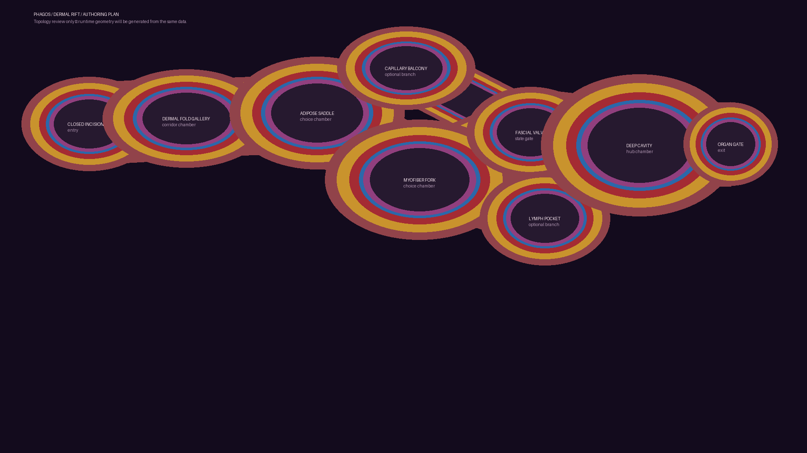

# PHAGOS production roadmap — dynamic exploration arena

## Product decision

The current skin cross-section is accepted as the **visual prototype** for the first biome. It is not the final game world and must not remain a frozen illustration.

PHAGOS is being developed as a dynamic exploration adventure:

- each organ is a recognizable biome with its own material hierarchy, topology, rhythm, and traversal vocabulary;
- routes change according to organ state, rather than using random room shuffling or visual noise;
- the player can learn, predict, and use those changes;
- arena motion is legible and safe, not a permanent chaotic overlay;
- Godot remains the engine and the direct WebView target is the Godot Web export.

## Public reference boundary

*Pathogenic* is a **high-level benchmark**, not a source of game content. Public materials describe a colorful procedural organic world with distinct organ environments and soft-body action; public screenshots show concise combat information and strong biome identity. PHAGOS can learn from that hierarchy—readable organ identity, material variety, changing runs, and active biological space—without reproducing its assets, rooms, UI, enemies, upgrades, or implementation. See the existing source register in [`REFERENCE_RESEARCH.md`](REFERENCE_RESEARCH.md).

## The real arena model

```text
Run seed
  └── Organ atlas (which organs exist and their progression links)
        └── Organ layout graph (chambers, ducts, junctions, gates, landmarks)
              └── Dynamic organ state (rest / contraction / surge / inflammation / recovery)
                    └── Rendered and collidable cross-section geometry
                          └── exploration, hero, UI feedback, encounters
```

The runtime never treats a corridor as only a painted line. A route has:

| Layer | Job | Production requirement |
| --- | --- | --- |
| **Anchor graph** | Stable chambers and connection logic | Reproducible from a seed and inspectable in debug mode |
| **Route geometry** | Curves, widths, wall bands, collision | Changes only inside a defined safe envelope |
| **Material profile** | Skin, fat, muscle, fascia, membrane, cavity | Follows the same anatomical order at every join |
| **Organ state** | Resting, contractile, vascular, inflamed, recovery | Changes route availability and visual rhythm intentionally |
| **Exploration contract** | What opens, closes, returns, or becomes optional | Never traps the active player or makes the map unreadable |

## First production biome: Dermal Rift

The first real arena is specified in [`data/organ_biomes/dermal_rift.json`](../data/organ_biomes/dermal_rift.json). It is an original PHAGOS layout, not a copied game map.

```text
[Surface Breach]
       │
[Dermal Gallery]
       │
[Adipose Saddle]────[Capillary Balcony]
       │                    │
[Myofiber Fork]────────[Fascia Valve]
       │                    │
[Lymph Pocket]───────[Deep Cavity]────[Organ Gate]
```



The image is a **review-only topology plan** rendered from the JSON data. The playable Godot runtime now loads the same graph for its cavity geometry, `StaticBody2D` collision, route availability, landmark discovery, state cues, and map affordance. The runtime uses position-specific tissue treatment rather than treating this diagram as a background image.

### Route intent

| Region | Exploration role | Tissue / colour logic | Dynamic behavior |
| --- | --- | --- | --- |
| Surface Breach | Entry and orientation | Skin, rose dermis, first fat reveal | Stable anchor; no surprise closure |
| Dermal Gallery | First long corridor | Warm skin → gold fat → muscle | Slow shear only; teaches wall order |
| Adipose Saddle | First choice | Gold lobules with controlled septa | Compression shifts width, never below safe width |
| Capillary Balcony | Optional upper route | Cool vascular/cyan emphasis | Opens during vascular surge |
| Myofiber Fork | Main lower route | Crimson directional fibers | Contracts laterally in a bounded envelope |
| Fascia Valve | State-aware gate | Blue fascia and inner membrane | Route selection changes by organ state |
| Lymph Pocket | Optional recovery branch | Lilac/immune material family | Appears during inflammation/recovery |
| Deep Cavity | Stable hub | Deep plum cavity, restrained detail | Safe gathering/navigation anchor |
| Organ Gate | Exit to next biome | Transition membrane | Locked by explicit progression only |

### Motion rules

Motion in the first biome is **not** particles, stains, random wobble, or camera shake. It is authored organ behavior:

1. **Contraction** — muscle-side corridors translate and narrow inside an approved width/offset range.
2. **Vascular surge** — an upper capillary route becomes readable and traversable while the lower return remains valid.
3. **Inflammation** — the valve redirects toward the lymph branch, with warmer swelling and no random debris field.
4. **Recovery** — routes reopen in a visible sequence; the player understands why the map changed.

Safety rules are data, not assumptions:

- minimum traversable width: **260 px**;
- maximum moving-anchor offset: **72 px**;
- one topology change at a time;
- at least 12 seconds between topology changes;
- never seal the active player cell;
- always retain a route to the previous stable anchor.

`tools/validate_arena_plan.py` verifies every authored state still connects entry → deep cavity → organ gate.

## Current playable proof — Dermal Rift expedition slice

The repository now contains a native Godot traversal slice that turns this contract into play:

- `scripts/traversal_cell.gd` provides a real `CharacterBody2D` controller with WASD/arrow input, sprinting, and collision;
- `scripts/dermal_rift_expedition.gd` loads the JSON plan, builds `StaticBody2D` boundaries for every current cavity, tracks discovery and objective progression, and refuses a route shift when the active explorer is outside a safe connected chamber;
- `scripts/dermal_rift_world.gd` draws the actual state-dependent cavity/organ layers from the same anchor/link data, including collapsed routes and moving chambers;
- `scripts/expedition_hud.gd` and `scripts/dermal_rift_map.gd` provide Godot-native objective, interaction, state-warning, discovery, and map surfaces;
- the player must reach the Deep Cavity, read its pulse, and then cross the Organ Gate. This gives the slice a playable explore → adapt → interact → exit loop before combat exists.

This is intentionally a **traversal proxy**, not a claim that the final immune hero, combat, or full organ atlas has already been designed. Its purpose is to prove that exploration and moving-route safety are playable before those systems are added.

## Development sequence

### Milestone 0 — foundation lock ✅

**Delivered:** Godot 4.3 project, Web export, direct WebView server, original layered anatomy studies, authored dynamic-arena data, a playable native traversal slice, and a headless runtime probe.

**Exit gate:** The same Godot export runs locally, in WebView, and in CI. No browser wrapper replaces the game.

### Milestone 1 — arena data and debug atlas *(in progress)*

**Already proven in the playable slice:** Dermal Rift JSON loads into the live Godot graph, route widths/anchor offsets drive geometry, and the runtime probe inspects state changes. **Remaining for this milestone:** deterministic seed/replay serialization and a production debug atlas.

**Build:**

- `OrganLayoutGraph`, `OrganNode`, `OrganLink`, `OrganState`, and seed/replay data structures in Godot;
- debug overlay that visualizes anchor graph, route width, current state, and reachable exit;
- Dermal Rift loaded from the committed JSON plan;
- deterministic regeneration from `run_seed`.

**Exit gate:** Reloading the same seed reproduces the graph, state order, and collision anchors exactly.

### Milestone 2 — navigable Dermal Rift *(playable proof delivered; hardening remains)*

**Already proven in the playable slice:** a controller traverses collidable generated cavities, discovers anchors, reads the Deep Cavity, and reaches the progression gate while state changes are safety-gated. **Remaining:** streaming, save/restore, and broader movement/collision stress tests.

**Build:**

- real collision/cavity boundaries from the anchor graph;
- streamed chamber/route construction around the camera;
- camera framing and debug traversal proxy;
- stable save/restore at named anchors.

**Exit gate:** A proxy can traverse all planned Dermal Rift paths without clipping through material or reaching an unconnected cavity.

### Milestone 3 — UI/UX system before hero *(first playable pass delivered; production system remains)*

**Already proven in the playable slice:** objective, interaction prompt, state preview warning, discovery count, discovered-only map, and completion feedback are native Godot UI. **Remaining:** accessibility, focus/navigation audit, localization, settings, and production theme components.

**Build:**

- Godot-native `Control` scene hierarchy, theme tokens, safe-area scaling, controller/mouse focus behavior, and localization-ready text surfaces;
- UI visual language based on PHAGOS's own material palette—not copied reference HUD art;
- minimal first-pass information hierarchy: objective/location, organism condition, map-state cue, interaction prompt, pause/settings;
- diegetic state cue that explains contraction/surge/recovery before routes move.

**Exit gate:** A first-time player can identify current organ, current route state, objective direction, and pause/settings actions without a tutorial overlay covering the arena.

### Milestone 4 — immune hero foundation

**Build:**

- `CharacterBody2D` immune-hero scene;
- input map, movement, collision, animation state machine, camera follow, and interaction ray/area;
- art placeholder replaced by original hero visual only after movement readability is approved;
- dynamic-boundary response: safe push-out, pause-before-seal, and route-change warning.

**Exit gate:** The hero remains controllable and never becomes embedded in a moving wall during every Dermal Rift state transition.

### Milestone 5 — dynamic organ runtime

**Build:**

- state director with deterministic timers/events;
- interpolated route geometry, collision commit phase, navigation refresh, and visual material state changes;
- state replay log and seeded bug reproduction;
- authored organ-state hooks for exploration and encounters.

**Exit gate:** All five Dermal Rift states pass automated route-safety validation and manual WebView playthroughs.

### Milestone 6 — second and third organ biomes

**Build:**

- two contrasting original organ layouts with new topology and material rules;
- organ atlas/progression links;
- shared generator constraints plus biome-specific authoring data;
- content pipeline for landmarks, gates, and state rules.

**Exit gate:** Each biome is identifiable in a still frame and changes differently in play; no biome is a recoloured Dermal Rift.

### Milestone 7 — exploration loop and production UI

**Build:**

- objectives, discoveries, route memory, map affordances, transition screens, accessibility settings, and save/load;
- production HUD only after the data it displays exists;
- performance budgets for desktop and Web export.

**Exit gate:** A complete explore → change-state → reroute → discover → exit loop is playable end-to-end in WebView.

### Milestone 8 — combat/content only after traversal is proven

**Build:**

- encounters, immune interactions, progression, and bosses only where they support exploration;
- no borrowed Pathogenic mechanics, names, enemy designs, or UI layouts.

**Exit gate:** Combat enhances the organ-navigation loop instead of hiding the arena's dynamic behavior.

## UI production rules

UI is a system, not decoration. Before final visual polish, define a component inventory and a data owner for every panel.

| Surface | Owns | Must not do |
| --- | --- | --- |
| Location/state strip | Organ name, state phase, route-change warning | Cover the entire arena or flash constantly |
| Organism condition | Health/condition values that actually exist | Invent meaningless meters |
| Map affordance | Discovered anchors, gate direction, current route state | Reveal undiscovered graph content by default |
| Interaction prompt | Context-specific action | Persist when no interaction is possible |
| Pause/settings | Input, accessibility, audio, export-safe settings | Depend on desktop-only input |

Visual production rules:

- Start with hierarchy, contrast, safe areas, and input focus—not glow.
- Use the arena's colour roles deliberately: blue = fascia/deep state, yellow = fat, red = muscle/vascular, purple = deep cavity.
- Animate UI only for new state, confirmed action, or critical warning.
- Every UI surface must work in the Godot Web export at 16:9 and reduced browser sizes.

## Definition of done for the prototype → production transition

The prototype graduates only when all of the following are true:

- Dermal Rift is graph-driven rather than a single baked static composition.
- The seed and organ state reproduce the same map behavior in desktop and WebView runs.
- The player can explore, retreat, understand a state change, and reroute without a soft lock.
- UI explains real state without obscuring the cross-section.
- Hero collision and moving walls are safe.
- A new organ can be authored by data and material profiles rather than by copying the first arena scene.
